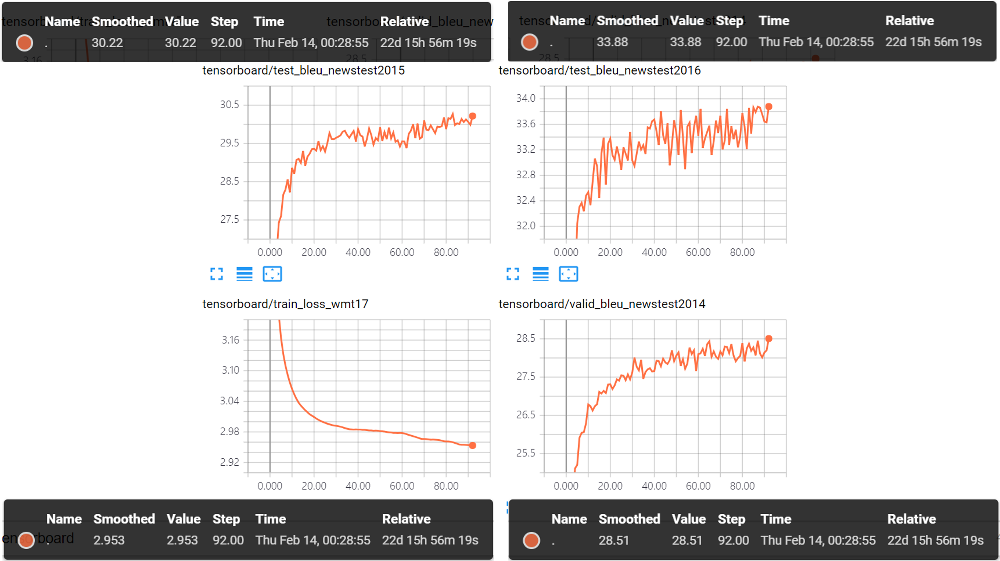

# TensorFlow-Transformer
Attention Is All You Need

## Translate EN into DE

## Paper
   * Attention Is All You Need: https://arxiv.org/abs/1706.03762
   * Layer Normalization: https://arxiv.org/abs/1607.06450
   * Label Smoothing: https://arxiv.org/abs/1512.00567 
   * Byte-Pair Encoding (BPE): https://arxiv.org/abs/1508.07909  
   * Beam-Search length penalty: https://arxiv.org/abs/1609.08144

## Env
   * GTX1080TI
   * ubuntu 16.04
   * CUDA 8.0
   * cuDNN 5.1
   * tensorflow 1.4
   * numpy
   * nltk (bleu)
   * tqdm (iteration check bar)
   * python 3
   

## Dataset
   * Preprocessed WMT17 en-de: http://data.statmt.org/wmt17/translation-task/preprocessed/ 
      * train_set: corpus.tc.[en, de]
      * dev_set: dev/newstest[2014, 2015, 2016].tc.[en, de]
       
   * learn and apply [Sentences were encoded using byte-pair encoding](https://github.com/SeonbeomKim/Python-Bype_Pair_Encoding)
      * num_merges: 35000
      * final_voca_threshold: 50    
      * generated bpe files are in bpe_dataset/
      
## Code
   * transformer.py
      * Transformer graph

   * inference_helper.py
      * greedy
      * beam (length penalty applied)
      * bleu (nltk)
              
   * bucket_data_helper.py
      * bucket으로 구성된 데이터를 쉽게 가져오도록 하는 class
      
   * make_dataset.py
      * generate bucketed bpe2idx dataset for train, valid, test from bpe applied dataset
      * need MakeFile of [Sentences were encoded using byte-pair encoding](https://github.com/SeonbeomKim/Python-Bype_Pair_Encoding) 
      * MakeFile: 
         * bpe_dataset/
            * source_idx_wmt17_en.csv (train)
            * target_idx_wmt17_de.csv (train)
            * source_idx_newstest2014_en.csv (valid)
            * source_idx_newstest2015_en.csv (test)
            * source_idx_newstest2016_en.csv (test)
            * train_set_wmt17/
               * source_(bucket_size).csv
               * target_(bucket_size).csv
            * [valid_set_newstest2014/, test_set_newstest2015/, test_set_newstest2016/]
               * source_(bucket_size).csv
               * target_(bucket_size).txt
               
   * translation_train.py
     * en -> de translation train, validation, test

## Training
   1. [WMT17 Dataset Download](http://data.statmt.org/wmt17/translation-task/preprocessed/)  
   2. [apply byte-pair_encoding](https://github.com/SeonbeomKim/Python-Bype_Pair_Encoding)
   3. run make_dataset.py
   4. run translation_train.py

## Reference
   * https://jalammar.github.io/illustrated-transformer/
   * https://github.com/Kyubyong/transformer
